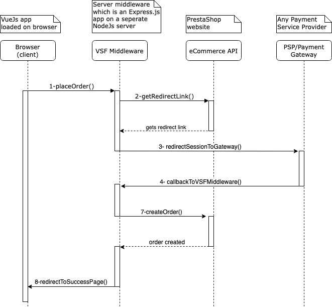

# Payment Basics

## How to implement payment options?
Normally, PSPs (Payment Service Providers)/Payment gateways, provide payment services in three ways: 
- Payment Links: through which you embed or share a link without a website
- Redirect: take your customers to the gateway pages
- SDKs: Integrate customizable UI components into our website

Here I just cover the redirect method, because most of the current PrestaShop modules already support this method, therefore it would be easier to implement. 

## Redirect Method

1. Customer clicks on Place Order in payment page. The request will be sent to the middlewre server (normally this happens when user clicks on something, like when user clicks on product detail page).
2. Middleware logic (in app-client) calls our eCommerce API (PrestaShop) to get a redirect link to the payment gateway. Probably, we need to pass callback/redirect back link to our website (which is a middleware API). In other words, this step is not just to get redirect link, in this step we get any data required for going to payment gateway, it could be a token, and it could be a generated redirect link to payment gateway.  
3. User will be redirected to payment gateway page.
4. Gateway will call our callback url (our old PrestaShop module front controller).
5. The payment module determines whether to redirect the user to a success page or a failure page.
