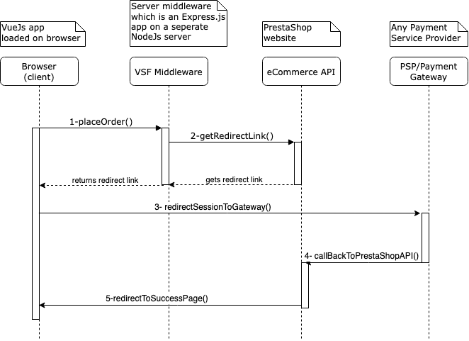

# Payment Basics

## Payment Options
Normally, PSPs (Payment Service Providers)/Payment gateways, provide payment services in three ways: 
- Payment Links: through which you embed or share a link without a website
- Redirect: take your customers to the gateway pages
- SDKs: Integrate customizable UI components into our website

Here I just cover the redirect method, because most of the current PrestaShop modules already support this method, therefore it would be easier to implement. 

## Redirect Method

